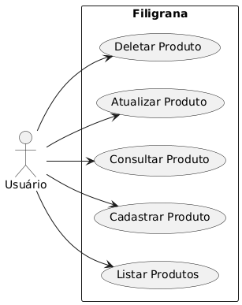
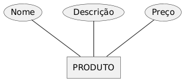

# Diagramas

Este diretório mantém os diagramas do projeto.

## Diagramas de Produto

_Figura: Diagrama de caso de uso de produto. [Arquivo original: CASO_DE_USO.plantuml](./CASO_DE_USO.plantuml)_

_Figura: Diagrama de entidade e relacionamento de produto. [Arquivo original: DER.plantuml](./DER.plantuml)_

## Diagramas de Cliente

_Figura: Diagrama de caso de uso de cliente. [Arquivo original: CasodeUsoCliente.plantuml](./CasodeUsoCliente.plantuml)_

_Figura: Diagrama de entidade e relacionamento de cliente. [Arquivo original: DER_Cliente.plantuml](./DER_Cliente.plantuml)_
